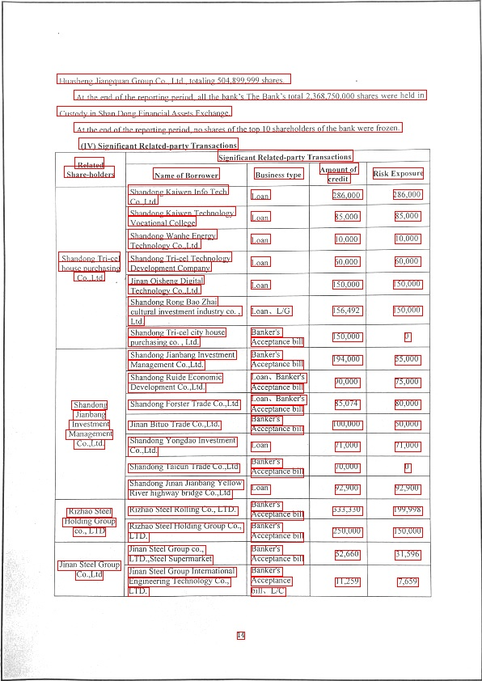

# CMAT

This repository is the official implementation of CMAT:A Cross-Model Adversarial Texture for Scanned Document Privacy Protection.

## Install

- Step 1. please follow the installation instructions of T-SEA to create a conda environment

  ```bash
  conda create -n text-attack python=3.7
  conda activate text-attack
  pip install -r requirements.txt
  ```
- Step 2. please follow the build-from-source instructions to install mmocr

  ```bash
  pip install -U openmim
  mim install mmcv-full
  pip install mmdet
  cd detlib/mmocr
  pip install -r requirements.txt
  pip install -v -e .
  ```

  and then go back to the root of the project，replace `lib/python3.7/site-packages/mmdet/models/detectors/base.py`with our `./base.py`
- Step 3. please install the following packets

  ```python
   pip install Image
   pip install jupyter
  
  #  if error about PIL exist, please uninstall pillow and re-install it with lower version
  pip uninstall pillow
  pip install "pillow<7"
  ```

## Attack

First of all, modify the line 15 of `configs/parallel.yaml`，add the DETECTOR which you need：

```bash
DETECTOR: #add the DETECTOR which you need
 NAME: ["PS_IC15"] #,"PS_CTW","PANET_IC15","PANET_CTW"]
 WEIGHT: [1.0, 1.0, 1.0] #Model loss Weight
```

### Single Model / Multy Model (However, no model loss weighting is performed)：

Please,set all weight to 1.0

and then run `train.sh`，you can check the results in tensorboard(or `results/crop.log`), also you will find the perturbation checkpoint in `/results/crop`.

```bash
CUDA_VISIBLE_DEVICES=0 nohup python train_optim_text.py \
-cfg=parallel.yaml -s=./results/crop \
-np >./results/crop.log 2>&1 &
```

#### Multy Model(Model loss weighting is performed)：

Run `train_parallel.sh`

```bash
CUDA_VISIBLE_DEVICES=0 nohup python train_parallel_text.py \
-cfg=parallel.yaml -s=./results/parallel \
-np >./results/parallel.log 2>&1 &
```

## Searching Weight

Search the best model loss weight with nnictl：

```
nnictl create --config ./nni_config.yaml 
```

## Evaluation

Set `data_root ` which is in `detlib/mmocr/configs/_base_/det_datasets/icdar2015.py` as dir of your dataset，change the pipeline in test：

```python
test = dict(
    type=dataset_type,
    ann_file=f'{data_root}/[json file name]',
    img_prefix=f'{data_root}/[Image dir name]',
    pipeline=None)
```

then，run `test.sh` in the root directory of the project，which makes you get the test result on Psenet-IC15：

```bash
CUDA_VISIBLE_DEVICES=0 python detlib/mmocr/tools/test_attack.py \
detlib/mmocr/configs/textdet/psenet/psenet_r50_fpnf_600e_icdar2015_adv.py \
https://download.openmmlab.com/mmocr/textdet/psenet/psenet_r50_fpnf_600e_icdar2015_pretrain-eefd8fe6.pth \
--eval hmean-iou --perturbation [perturbation file path]
--show --show-dir [the path saved the result]
```

where, you can set perturbation as the path of your perturbation file. After the run is complete, you can see the test result of the test set image in show-dir.

## Dataset

We provide the dataset AdvDocument which mentioned in our paper and used in our project.Our datasets are annotated according to the COCO format.

You can download AdvDocument by the [link](https://drive.google.com/file/d/1r4scB0HvLdz1NLinWI0KClqyyF8UrWnN/view?usp=drive_link "Google Drive").

### Display



## Citation

Please cite this repo if you decide to use our code for any part of your research.
```latex
@misc{Ye2024CMAT
  author={Xiaoyu Ye, Jingjing Yu, Jungang Li, Yiwen Zhao, Qiutong Liu},
  title={CMAT:A Cross-Model Adversarial Texture for Scanned Document Privacy Protection},
  year={2024},
  url={https://github.com/LJungang/CMAT}
}
```
